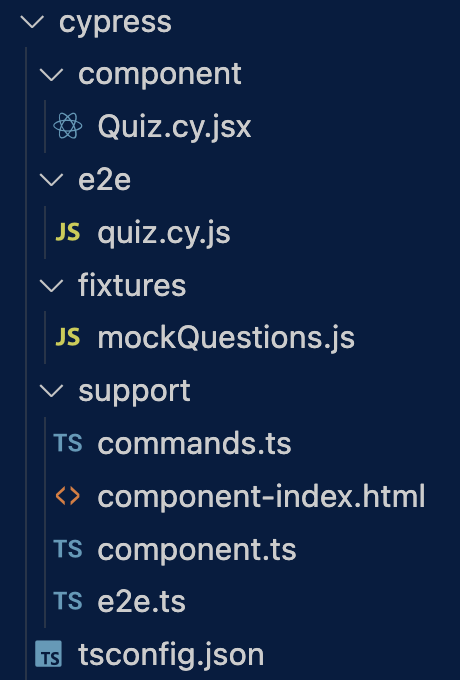

# Kikta_Tech_Quiz_Testing
This app is a fully functioning Tech Quiz application with Cypress based testing.  

## 📚 Description
The additions to the fully functioning Tech Quiz created in this application center on developing both component and end-to-end testing. 

[Video](Video link) 

## 🚀 Table of Contents
  * [Usage](#📝-Usage)
  * [Features](#⭐-features)
  * [Credits](#🫱🏽‍🫲🏾-credits)
  * [License](#📃-license)
  * [Contact](#🗨️-contact)

## 📝 Usage
<strong>Testing the Application</strong>

Here are screenshots of the code testing 

<u><strong>Cypress File Structure</strong></u>

<u><strong>Passed Tests</strong></u>

Back to [Table-of-Contents](#🚀-table-of-contents)

## ⭐ Features
  * Component Testing on Quiz
  * End-to-End testing on Application

Back to [Table-of-Contents](#🚀-table-of-contents)

## 🫱🏽‍🫲🏾 Credits

For testing purposes, Cypress was used. 

[Cypress](https://docs.cypress.io/app/get-started/why-cypress)

This application was created to requiresthe use of Express.js, MongoDB database, and Mongoose ODM. 

[MongoDB Docs](https://www.mongodb.com/docs/)

Back to [Table-of-Contents](#🚀-table-of-contents)

## 📃 License
This application is unlicensed. 

Back to [Table-of-Contents](#🚀-table-of-contents)

## 🗨️ Contact

  <strong>Email:</strong> [MelissaKikta2025@u.northwestern.edu](mailto:MelissaKikta@u.northwestern.edu)
  
  <strong>GitHub:</strong> [GitHub.com/MelissaKikta](https://github.com/melissakikta)

Back to [Table-of-Contents](#🚀-table-of-contents)
